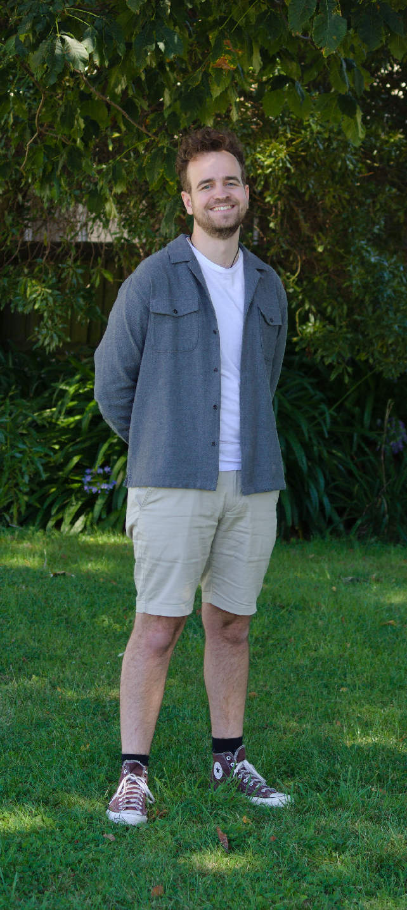

<section id="pepeha">
    
I tipu ake ahau ki te tāwharau o Tarahaoa

    
Ko Waitaki te awa

    
Nō Te Tihi-o-Maru ahau

    
Kei Ōtautahi ahau e noho ana

    
Ko Waitaha te Whare Wānanga

    
Ko Hay te whanau

    
Ko Jordan tōku ingoa

    
No reira, tēnā koutou, tēnā koutou, tēnā koutou katoa

</section>

<section id="introduction">
    

        Hi, my name is Jordan Hay. I grew up in Timaru and now study at the University of Canterbury (UC)
        in Christchurch. I am interested in electronics, radio communications, operating systems, 
        cycling, Geocaching, and photography.
    

    

        I am in my third year of study towards a Bachelor of Engineering (with honours) specialising 
        in Computer Engineering and aim to complete a minor of Communications and Network Engineering.
        I also tutor COSC122: Introduction to Computer Science. This involves weekly computer lab 
        sessions where I help students learn foundational computer science skills alongside Python 
        programming.
    

    
    

        Professionally I have worked as a Digital Services Assistant and a Trainee Radio Technician at 
        Alpine Energy Ltd. and Ashley Communications Ltd. respectively. I have a solid foundation in
        practical electronics and information technologies through my experience in these roles.
    

    

        I have a list of <a href="/projects">my projects</a>. I also occasionally write 
        <a href="/articles">articles</a>. If you're keen to learn a bit more about what I have done 
        professionally, you may view a simplified version of my <a href="/cv">CV</a>. I also put most 
        things on my <a href="https://github.com/JHay0112">Github</a>.
    

</section>